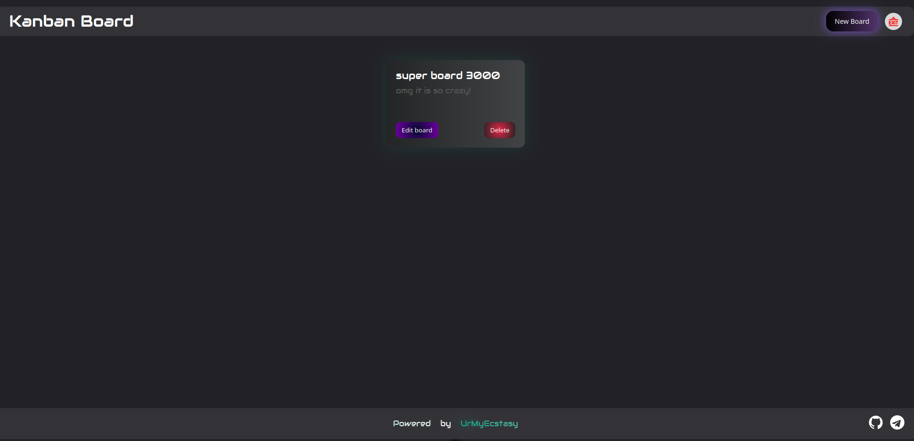

# Kanban Board  

A web application for task management using **Kanban boards**.  
Built with **Vue 3 + Vite**, featuring authentication, role-based access control, and team collaboration.  

---

## Features

### 🔑 Authentication
- User login and registration.  
- Tokens stored in `localStorage`.  
- Logout with confirmation dialog.  

### 🗂 Boards Management
- View all boards you own or shared with you.  
- Create new boards.  
- Edit board title and description.  
- Delete boards (with confirmation).  
- Buttons for **edit** and **delete** are shown only if the user has the required permissions.  

### 📊 Inside the Board
- Add new statuses (columns).  
- Edit and delete statuses (with confirmation).  
- Add tasks to a column.  
- Edit task details.  
- Delete tasks (with confirmation).  
- Drag and drop tasks between statuses.  
- Deadline indicators with colored dots (green/yellow/orange/red).  

### 👥 Members & Permissions
- View all members of the board.  
- Invite users by email via **Share modal**.  
- Remove users from the board.  
- Grant or revoke specific permissions.  
- Own account cannot be deleted or modified by yourself (instead it shows *"(you)"*).  
- Icons, menus, and actions are only visible if the current user has the required permissions.  

---

## Permissions System

Each user on a board can have a set of permissions that determine what actions are available.  

| Permission Key             | Description |
|-----------------------------|-------------|
| **manage-board**            | Allows editing the board (title, description). |
| **delete-board**            | Allows deleting the board. |
| **manage-board-statuses**   | Allows adding and editing statuses (columns). |
| **delete-board-statuses**   | Allows deleting statuses (columns). |
| **manage-board-users**      | Allows managing board members (invite, remove, change permissions). |

**Important:**  
If a user does **not** have a permission, related buttons or actions will not even be displayed in the UI.  

---

## Getting Started

### 1. Install dependencies
```sh
npm install
````

### 2. Run in development mode

```sh
npm run dev
```

The app will be available at:

```
http://localhost:5173
```

### 3. Build for production

```sh
npm run build
```

### 4. Preview production build

```sh
npm run preview
```

---

## Tech Stack

* [Vue 3](https://vuejs.org/) — frontend framework
* [Vite](https://vite.dev/) — dev server and bundler
* [Axios](https://axios-http.com/) — API requests
* [Vue Router](https://router.vuejs.org/) — navigation
* [Vue Draggable](https://github.com/SortableJS/vue.draggable.next) — drag-and-drop for tasks

---

## 📸 Screenshots 

start page


auth and login


view of the boards list


inside the board


modal with members and permissions

